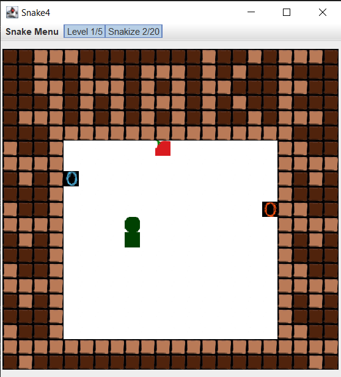
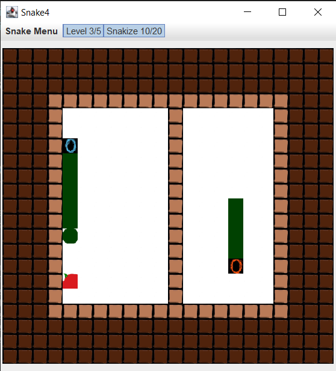
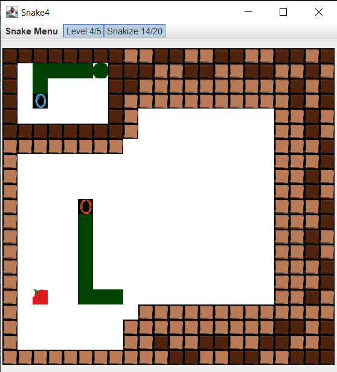

# Snake4

Snake with portals - Quakathon 2017

This project started out at Dundee University Quakathon in January 2017 (24hour hackathon). We made great progress on the day, but didn't actually make a working version.
You can see our last version on the day of the hackathon here: [3879b84 on 6 Jan 2017](https://github.com/alfanhui/snake4/commit/3879b84bdf08b64fdffa803958108415652b4d0b).

Feeling partially to blame for the lack of a working prototype due to misunderstand the way location were stored (multi-dimensional array over single array for grid locations), I have taken up this project post-hackathon to complete it as we had envisioned.





## Prerequisites

- [Download OpenJDK Java 11 (from Amazon)](https://docs.aws.amazon.com/corretto/latest/corretto-11-ug/downloads-list.html)

## How to Run

Download the .exe from [releases](https://github.com/alfanhui/snake4/releases/tag/v1.0.0)

Or

```bash
./mvnw compile exec:exec
```

Or

```bash
./mvnw package
java -jar ./target/snake*-shaded.jar
```

Or

Use VSCode's Run and Debug (Press F5)

Or

```bash
./mwnw package
./target/snake*.exe
```

## How to Run the Tests

```bash
./mvnw test
```
